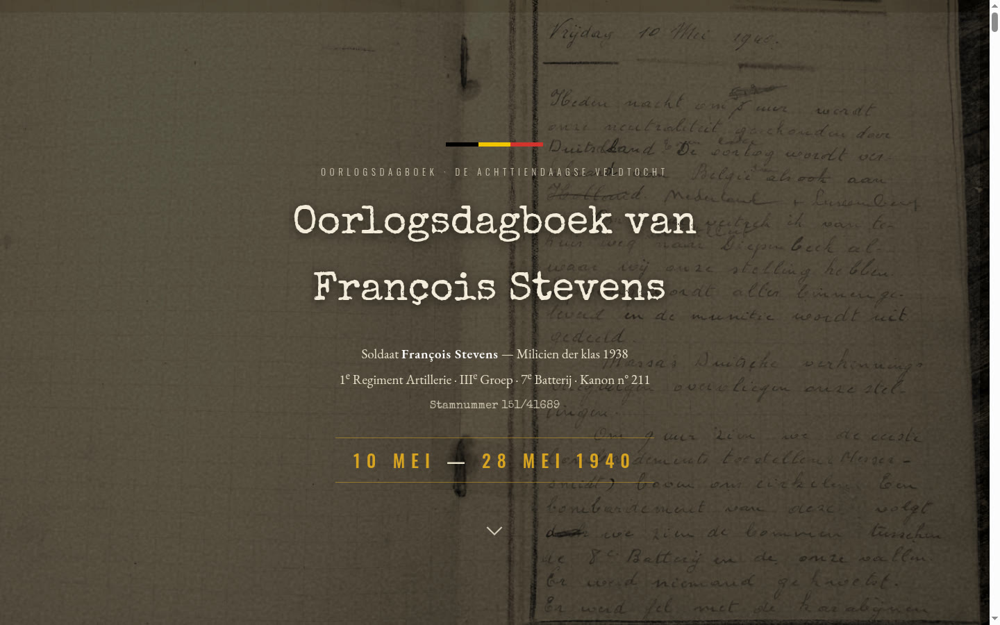

# Oorlogsdagboek François Stevens — 10 mei · 28 mei 1940

**[→ Bezoek de website](https://tom-michiels.github.io/oorlogsdagboek-francois-stevens/)**

Interactieve website rond het handgeschreven oorlogsdagboek van soldaat François Stevens
(1e Regiment Artillerie, IIIe Groep, 7e Batterij), bijgehouden tijdens de Achttiendaagse
Veldtocht van 10 tot 28 mei 1940.

**Talen:** Nederlands · Français · English · Deutsch (taalwisselaar in de navigatie, of `?lang=nl|fr|en|de`)

- Volledige transcriptie van alle 65 pagina's, dag per dag op een tijdlijn
- Interactieve kaart met de route van de terugtocht en de terugkeer naar huis (moderne OSM standaard; NGI-topokaart 1939 als optie)
- 3D-bladerboek waarin je door het originele schriftje kunt bladeren

De site is puur HTML/CSS/JavaScript, zonder build-stap. Open `index.html` lokaal of bezoek de
[GitHub Pages-versie](https://tom-michiels.github.io/oorlogsdagboek-francois-stevens/).

Bestanden voor meertaligheid: `i18n.js` (UI), `data.js` (NL), `data-fr.js`, `data-en.js`, `data-de.js`.

## Bezoekersstatistieken (GoatCounter)

De site telt pageviews via [GoatCounter](https://www.goatcounter.com/) (privacyvriendelijk, geen cookies).

1. Maak een gratis account op https://www.goatcounter.com/signup
2. Kies als site-code precies: `oorlogsdagboek-stevens`
3. Bevestig je e-mailadres

Daarna zie je de statistieken op:
https://oorlogsdagboek-stevens.goatcounter.com
